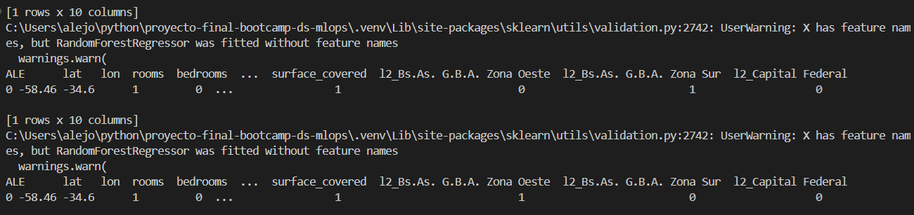

# proyecto-final-bootcamp-ds-mlops
Proyecto final del Bootcamp de Data Science y MLOps, dictado por Escuela de Datos Vivos

## 📊 **Parte 1 — EDA y Preparación de Datos**

### 🔹 **Entregables de esta parte**
*   **Conclusiones de negocio:** Presentar conclusiones que sirvan para conocer los datos desde una perspectiva de negocio.
*   **Storytelling:** Las conclusiones deben estar apoyadas en una narrativa o storytelling que guíe el análisis.
*   **Código y comentarios:** 

## 🤖 **Parte 2 — Modelado y Evaluación**

### 🔹 **Entregables de esta parte**
*   **Notebook de modelado:** Incluir el proceso de entrenamiento, las métricas obtenidas y un breve análisis de los resultados.
*   **Insights del modelo:** variación según el precio máximo y según las columnas. comentar hiperparámetros
*   **Justificación de variables:** Explicar qué variables se incluyeron en el modelo final y cuáles se descartaron, fundamentando la decisión.
*   **Exportación del modelo:** 

## 🖥️ **Parte 3 — Interfaz con Gradio y Deploy en Hugging Face Spaces**

### 🔹 **Entregables de esta parte**
1.  Subir el proyecto a **Hugging Face Spaces** (utilizando el tipo de aplicación "Gradio").
2.  Verificar que la aplicación funcione correctamente en línea.
3.  Incluir en el archivo `README.md` del repositorio:
    *   El link al Space de Hugging Face.
    *   Una captura de pantalla de la aplicación en funcionamiento.
    *   Un ejemplo de uso del endpoint que proporciona Gradio una vez desplegado.

https://huggingface.co/spaces/alejo-cuello/proyecto-final-bootcamp-ds-mlops

