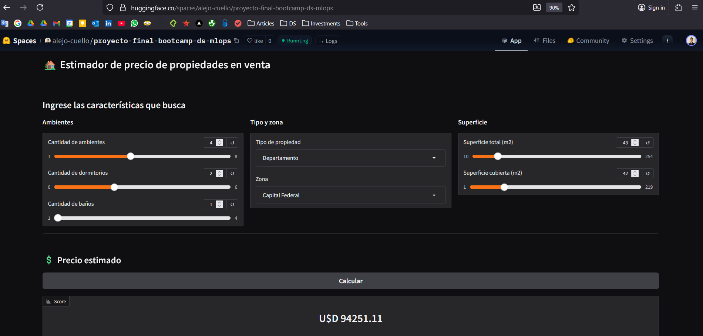
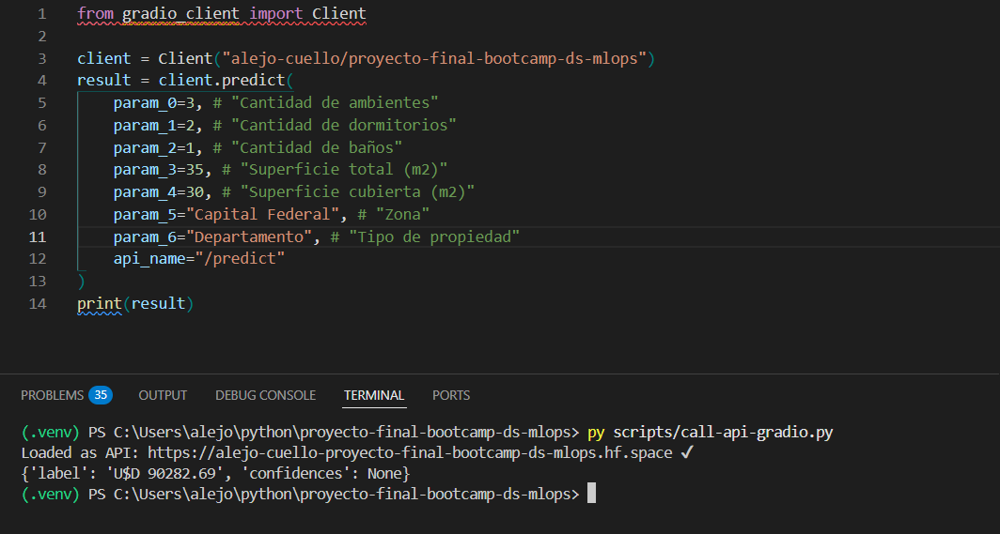
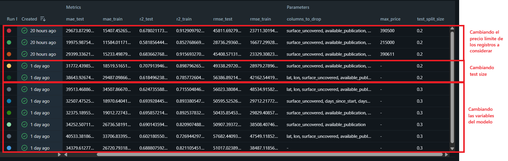
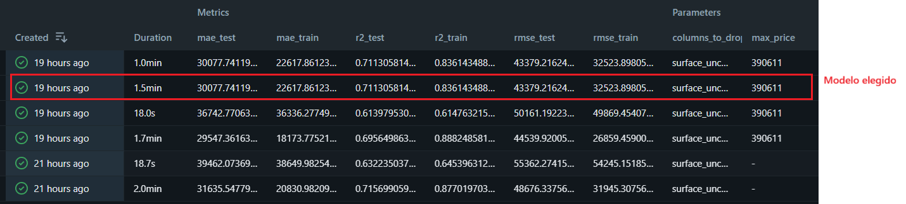
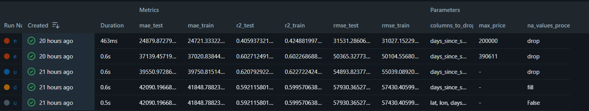

# Estimador de precios de propiedades
Proyecto final del Bootcamp de Data Science y MLOps, dictado por Escuela de Datos Vivos

## 📊 **Parte 1 — EDA y Preparación de Datos**

*   **Conclusiones de negocio y Storytelling**: ver en la sección *Conclusiones de negocio* más abajo
*   **Código y comentarios:** ver el archivo notebooks/01-eda.ipynb

## 🤖 **Parte 2 — Modelado y Evaluación**

*   **Notebook de modelado:** 
- Ver los scripts dentro de la carpeta *scripts/models*. Para una mayor explicación del proceso de modelado, consultar la sección *Explicación del proceso de modelado de datos* de este archivo.
*   **Insights del modelo:**:
- Las variables seleccionadas para entrenar el modelo influyeron en la precisión del mismo, pero no tanto como el límite que se establezca para el precio de los registros a utilizar en el modelo.
- Randomized Search ofrece un modelo con bajo error en train, pero no garantiza que el error sea similar en test. Por lo tanto, busqué modelos más estables mediante GridSearchCV, que tengan un error un poco más alto en train, pero más cercano al error de test.  
*   **Justificación de variables:**
-   Descarté las variables "available_publication", "days_since_start", "days_since_end" porque no están correlacionadas con el precio. Además, un usuario siempre consultará por propiedades que estén disponibles.
- También descarté "surface_uncovered", ya que se obtiene a partir de la resta entre superficie total y la cubierta, siendo estas más comunes a la hora de consultar por una propiedad.
*   **Exportación del modelo:**
- El modelo fue exportado mediante MLFlow. Puede encontrarse en la carpeta *mlruns/512582443179615027/models/m-0248ec91bbc349f393da1c30e4f3fed1/artifacts/model.pkl* 

## 🖥️ **Parte 3 — Interfaz con Gradio y Deploy en Hugging Face Spaces**

El principal desafío al construir la interface fue la gestión de las variables de latitud y longitud, ya que no fue posible implementar un mapa para que el usuario indicara estos puntos, por lo que estas variables quedaron codificadas con un valor promedio.

Opté por guardar previamente los valores mínimos y máximos admitidos para cada columna, limitando al usuario a ingresar inputs adecuados. Sin embargo, se nota que si se ingresan valores poco razonables en cuanto a la proporción de habitaciones o superficies, la proyección de precio suele estancarse ignorando la zona o el tipo de propiedad. Esto subraya la necesidad de limitar la proporción entre los valores de entrada del usuario.

*   **Url del Hugging Face Space:** 
https://huggingface.co/spaces/alejo-cuello/proyecto-final-bootcamp-ds-mlops

*   **Aplicación en funcionamiento:**

*   **Uso del endpoint proporcionado:**

## ✅ Aprendizajes técnicos relevantes:
- Para agilizar el entrenamiento de modelos ante datasets tan grandes, el muestreo es una buena opción, siempre que sea una proporción representativa del total.
- El proyecto enseñó la relevancia de la automatización: se aprendió a realizar el tracking de las pruebas con MLflow, lo cual fue muy útil. Esto permitió parametrizar fácilmente las distintas corridas ejecutadas, teniendo a simple vista todos los resultados de hiperparámetros y scores.

## Anexo:

### 🔹 Conclusiones de negocio
**¿Alguna vez viste una propiedad donde la superficie cubierta es mayor que la total?**

Parece absurdo, pero en los datos ocurre, y muchas de esas publicaciones ni siquiera están disponibles. De hecho, la mayoría del mercado ya está fuera de línea, como si las mejores oportunidades hubieran desaparecido antes de tiempo.

**¿Por qué es tan difícil encontrar casas en Capital Federal?**

Porque su proporción es mínima en comparación con otros tipos de propiedades. Y aun así, las más caras siguen concentrándose allí y en GBA Norte, donde también se encuentran los inmuebles de mayor tamaño y superficie.

**¿Las zonas baratas comparten algún patrón?**

Sí: GBA Oeste y GBA Sur muestran una distribución de precios prácticamente idéntica, mucho más accesible. Además, aunque las publicaciones finalizadas son similares entre zonas, las que siguen activas presentan diferencias más marcadas.

**¿Influyen la antigüedad o la ubicación exacta en el precio?**

Sorprendentemente, casi nada: latitud, longitud y días de publicación tienen muy poca correlación con el valor en dólares.

**¿Qué características influyen en el precio de una propiedad más allá de la zona y el tipo de propiedad?**

Lo que realmente importa es más tangible: cuántos baños tiene la propiedad y cuánta superficie cubierta ofrece.

### 🔹Explicación del proceso de modelado de datos:
Mi fase de modelado comenzó con el Random Forest Regressor, elegido por ser una alternativa sólida para un primer acercamiento. Inicié con una división del 30% para la data de prueba, aunque rápidamente me ajusté al 20% para obtener mejores resultados en la evaluación del rendimiento. El objetivo era optimizar los hiperparámetros mientras evaluaba métricas cruciales como R cuadrado, MAE (Error Absoluto Medio) y MSRE (Error Cuadrático Medio).

Apliqué primero la búsqueda aleatoria (Randomized Search) para encontrar los mejores ajustes iniciales. Aunque luego ajusté estos parámetros con Grid Search CV, el error del mejor modelo seguía siendo notablemente grande y muy variable entre los datos de entrenamiento y prueba. Esta inestabilidad me obligó a dar un paso crucial hacia atrás en la limpieza de datos para mejorar la predicción, confirmando que la limpieza nunca termina.

La decisión más importante fue eliminar los outliers de registros con precios muy elevados, ya que generaban sesgos significativos en las predicciones. Esta intervención provocó una mejora notable en la estabilidad y el rendimiento del modelo de Random Forest, reduciendo el error. Al volver a aplicar Randomized Search y luego Grid Search, pude enfocarme en un modelo más estable, priorizando menor diferencia de error entre train y test. Este límite de precio máximo también lo trabajé como un parámetro de las corridas, ya que es un dato importante de considerar a la hora de decidirse por un modelo.

Paralelamente a la optimización del random forest, también exploré el modelo más sencillo y rápido de Regresión Lineal. Aunque realicé los mismos ajustes, como variar las columnas consideradas y aplicar el recorte de outliers, sus resultados de rendimiento fueron consistentemente mucho más bajos. En comparación con los modelos de Random Forest, la Regresión Lineal no demostró ser una alternativa viable para esta tarea predictiva.

La clave para gestionar esta serie de experimentos y ajustes —que me hicieron ir y venir— fue la implementación de MLflow. MLflow lo utilicé para el tracking de todos los hiperparámetros, scores y variables, permitiendo una rápida evaluación de las distintas corridas ejecutadas. Pude parametrizar todo fácilmente en archivos .py, asegurando que cada resultado obtenido quedara registrado de forma sencilla y automatizada.

**Métricas del modelo seleccionado:**
- mae_train: 22617.86
- mae_test: 30077.74
- p2_train: 0.83
- p2_test: 0.71
- rmse_train: 32523.89
- rmse_test: 43379.21

### 🔹Puntos de mejora:
- Se podría probar la agrupación de variables categóricas que se mantuvieron en consideración pero que cuentan con pocos registros.
- También sería útil normalizar las distintas variables; por ejemplo, la superficie suele ser un número muchísimo mayor que la cantidad de ambientes, y normalizarlas podría mejorar el rendimiento.
- Para entender la influencia real de cada factor, una mejora clave sería utilizar Shap para evaluar el peso de las variables en el modelo.
- Además, sumaría información el análisis visual de la distribución del error de los residuos del modelo, junto con el análisis de la curva ROC respecto a los datos de train y test.
- Otro punto crucial es refinar el preprocesamiento; se sugiere variar el orden en que se ejecutaron las imputaciones, la detección de outliers y el llenado de nulos para observar cómo varía el resultado.
- Además, para capturar dinámicas más complejas, se podría analizar la relación no lineal entre las variables, quizás mediante el uso de MIC.
- También sería útil analizar gráficamente las correlaciones y medir la correlación de las variables categóricas utilizando encoding.

### 🔹Definición con la gente del negocio:
Entiendo que sería importante negociar el rendimiento del modelo con los stakeholders o la gente de negocio. No se trata solo de minimizar el error técnico, sino de evaluar qué error es aceptable y qué alcance tendrá la predicción. Es crucial saber negociar qué se puede predecir con el modelo en función del error máximo admitido.

La exclusión de los outliers de precios muy elevados demostró ser una decisión que redefinió el alcance del modelo, ya que generaban mucho sesgo en la predicción.
Al ser pocas las casas muy grandes y caras, lo más sensato fue dejarlas por fuera para limitar la predicción a casas y departamentos más comunes. Esto requiere definir con el negocio si ese error y ese límite en el alcance son aceptables.

Se subrayó la importancia de poseer un criterio sólido y conocimiento del negocio inmobiliario durante todo el proceso. Este conocimiento es una gran ayuda a la hora de analizar los datos, permitiendo identificar qué variables tienen más potencial de influir en el precio. Esto orienta significativamente tanto el análisis exploratorio como la limpieza de los datos.

Otro punto vital es que, aunque se realice una primera limpieza de datos con buen criterio, los resultados del modelo pueden no ser los esperados, obligando a volver hacia atrás en el proceso.
