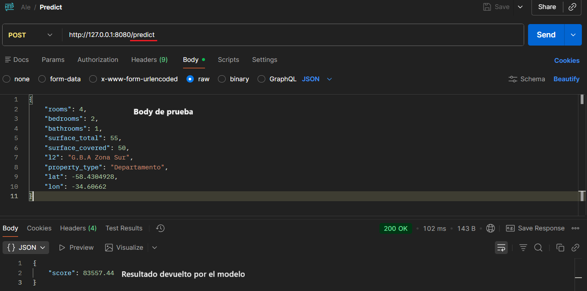

Para probar la ejecución de un servidor local que consuma el modelo logrado con este proyecto:
**1-** Abrir una consola de comandos
**2-** Ubicarse en la carpeta raíz de este proyecto
**3-** Escribir el siguiente comando:
```
py extras/local-server/main.py
```
**4-** Llamar el endpoint */predict* desde Postman (o cualquier herramienta similar):



Body utilizado en el ejemplo:
```
{
    "rooms": 4,
    "bedrooms": 2,
    "bathrooms": 1,
    "surface_total": 55,
    "surface_covered": 50,
    "l2": "G.B.A Zona Sur",
    "property_type": "Departamento",
    "lat": -58.4304928,
    "lon": -34.60662
}
```